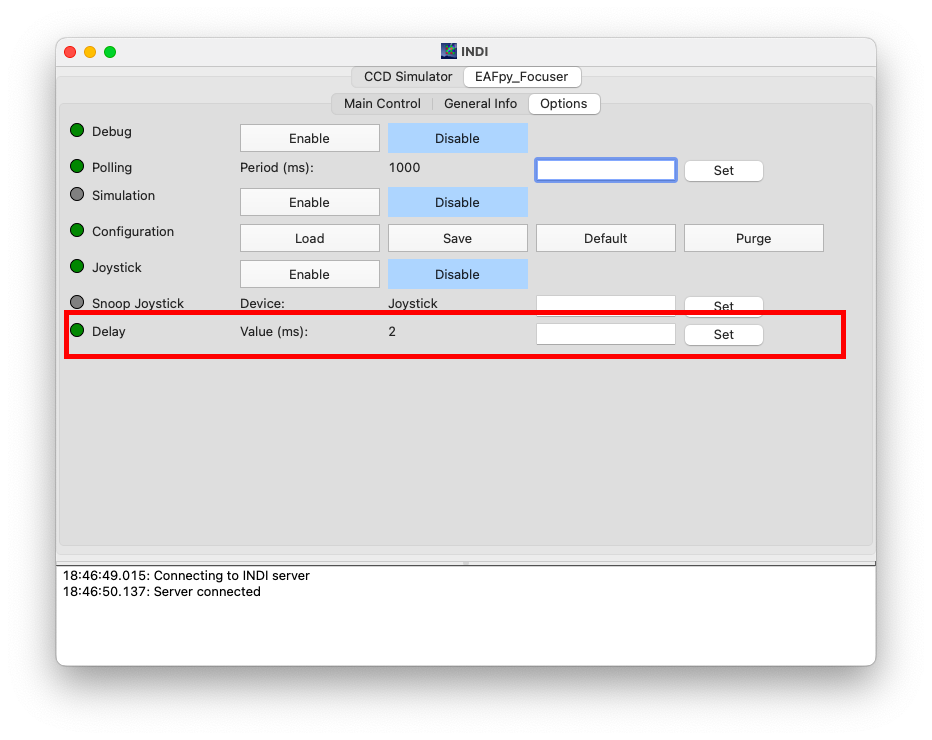

# 3Dfocuser
3D focuser for indilib

## Draw

## Download
```sh
cd
git clone https://github.com/dtouzan/3Dfocuser
```

## Install (For Raspberry Pi Zéro 2 W)
```sh
sudo cp ~/3Dfocuser/Build/indi_EAFpy_focuser /usr/bin/indi_EAFpy_focuser
sudo cp ~/3Dfocuser/Build/indi_EAFpy_focuser.xml /usr/share/indi/indi_EAFpy_focuser.xml

cd
mkdir -p ~/EAFpy
cp ~/3Dfocuser/Sources/*.py ~/EAFpy
```

## Rebuild 

```sh
cd
git clone https://github.com/dtouzan/3Dfocuser
mkdir build
cd build
cmake -DCMAKE_INSTALL_PREFIX=/usr -DCMAKE_BUILD_TYPE=Debug ~/3Dfocuser/Sources
make
sudo make install
```

## Interface (With CCDCIEL)
### Connect


### Used


### Driver info for speed


### Driver info for delay for step motor
