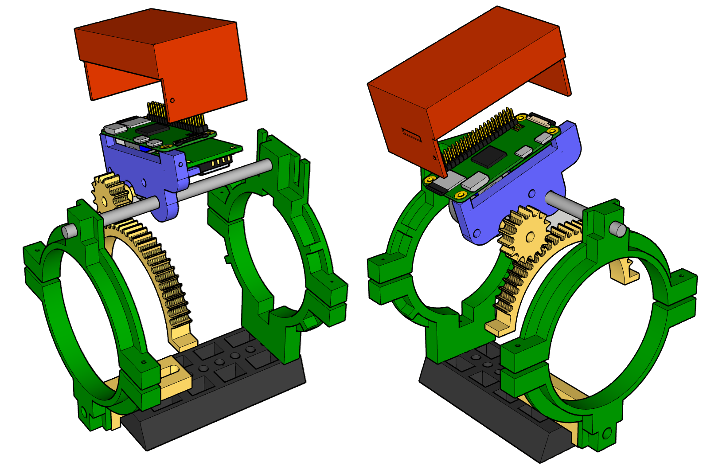

# 3Dfocuser
3D focuser for indilib

## Draw


## Download
```sh
cd
git clone https://github.com/dtouzan/3Dfocuser

pip install RPI.GPIO
```

## Install (For Raspberry Pi Zéro 2 W)
```sh
sudo cp ~/3Dfocuser/build/indi_EAFpy_focuser /usr/bin/indi_EAFpy_focuser
sudo cp ~/3Dfocuser/build/indi_EAFpy_focuser.xml /usr/share/indi/indi_EAFpy_focuser.xml
chmod +x /usr/bin/indi_EAFpy_focuser

cd
mkdir -p ~/EAFpy
cp -r ~/3Dfocuser/indi-3rdparty/EAFpylib/dist/EAFpyGPIO_OUT ~/EAFpy
cp -r ~/3Dfocuser/indi-3rdparty/EAFpylib/dist/EAFpyMotor ~/EAFpy
chmod -R +x ~/EAFpy
```

## Rebuild (after installing indilib development)

```sh
cd
mkdir build
cd build
cmake -DCMAKE_INSTALL_PREFIX=/usr -DCMAKE_BUILD_TYPE=Debug ~/3Dfocuser/indi-3rdparty/indi_EAFpy_focuser
make
sudo make install
```

## Start 
```sh
cd
indiserver indi_EAFpy_focuser indi_simulator_ccd
```

## Connect motor


## Interface (With CCDCIEL)
### Connect


### Used


### Driver info for speed


### Driver info for delay for step motor


## Python usage
```python
from ciboulette.indiclient import indiEAFpy

# Create EAFpy
focus = indiEAFpy.EAFpy('IP address or host name',7624)

# Go to 30 step
focus.ticks = 30

# Initialized number of steps
focus.ticks
return 30

# Initialized moving outward
focus.outward

# Initialized moving inward
focus.inward

# Focus direction (inward, outward)
focus.direction
return (On, Off)

# Initialized focus delay
focus.delay = 5

# Focus delay
focus.delay
return 5.0

# Initialized speed 1
focus.speed1

# Initialized speed 2
focus.speed2

# Speed (speed 1, speed 2)
focus.speed
return ('On', 'Off')
```
